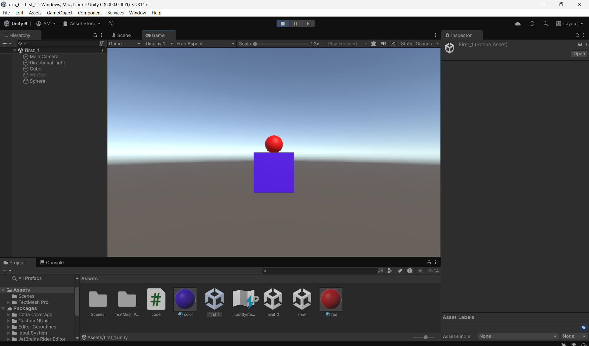
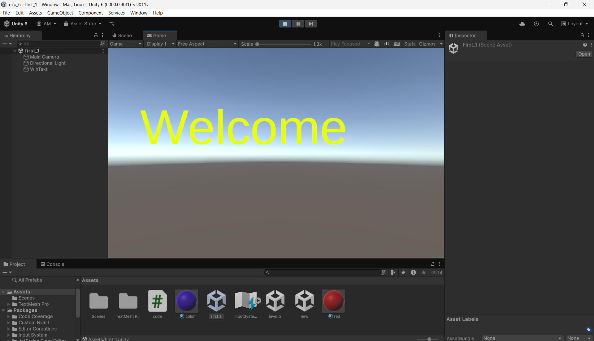
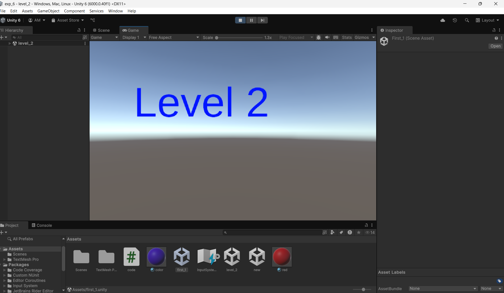

# Ex06-Redirect the Scene

## Aim :

To Redirecting the scene in the unity engine.

## Algorithm :

### Step 1 :

To open the unity engine.

### Step 2 :

Create a new 3D project.

### Step 3 :

Create plane and name it as ground and create cube and name it as player.

### Step 4 :

Add WinText in Hierarchy.

### Step 5 :

Create a C# Script and name it as playercontroller and add the script to player.

### Step 6 :

Use the R button to change the level 2

### Step 7 :

Print the Output and end the program.

## Program:
```cs

using UnityEngine;
using UnityEngine.SceneManagement;

public class code : MonoBehaviour
{
    Rigidbody rb;
    public GameObject WinText;  
    // Start is called once before the first execution of Update after the MonoBehaviour is created
    void Start()
    {
        rb = GetComponent<Rigidbody>();
    }

    // Update is called once per frame
    void Update()
    {
        if (Input.GetKeyDown(KeyCode.R))
        {
            SceneManager.LoadScene("level_2");
        }
    }
    private void OnTriggerEnter(Collider other)
    {
        if (other.gameObject.tag == "Cube")
        {
            Destroy(other.gameObject);
            WinText.SetActive(true);
        }
    }
}


```

## Output:



## Result:
The above C# coding is successfully redirecting the scene in the unity engine.

